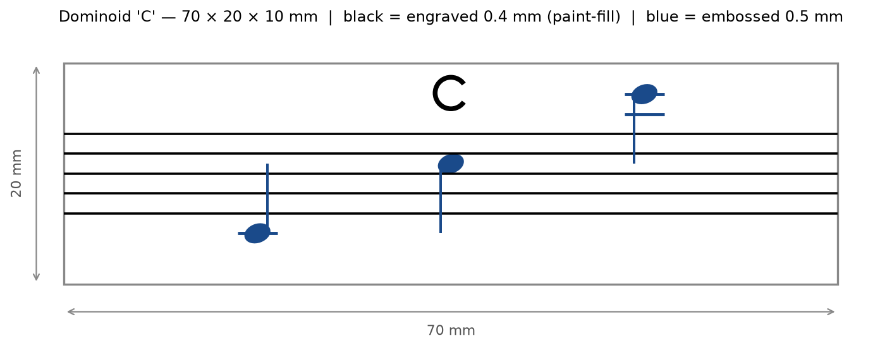
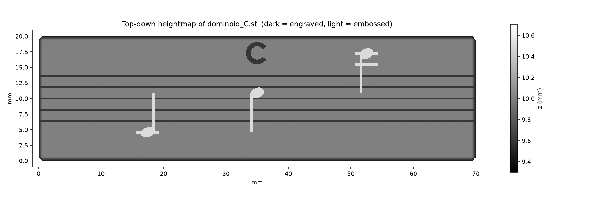

# Dominoid

Musical domino tiles for resin printing.

The idea (Dad's): a set of solid tiles, each carrying a five-line staff
engraved edge to edge, so that tiles laid side by side form one continuous
staff. Each tile shows a single note letter as crotchets in its octave
positions, ledger lines included, with the letter as a heading at the top.
Using a circle-of-fifths chart to pick the notes of any scale (major,
minor, melodic and so on), you lay out or rack the tiles and the scale
appears as written notation — building it yourself teaches the sharps,
flats, scale degrees and raised sevenths far better than reading a chart.
Great for practising clarinet scales; LEDs per note may follow.

## The C prototype

`output/dominoid_C.stl` — portrait tile, 20 mm wide × 70 mm high ×
5 mm thick, millimetre units, 0.6 mm chamfered edges. Tiles stand side
by side along the 20 mm edge, so an eight-note scale lines up in about
16 cm.

- **Engraved 0.4 mm deep** (recessed, for black paint-fill): the five
  staff lines, 0.35 mm wide, centred on the height and running edge to
  edge across the width so adjacent tiles carry one continuous staff;
  the capital C heading at the top.
- **Embossed 0.5 mm proud** (raised, tactile, dry-brush black): three
  crotchets for C in treble clef, ascending left to right in columns
  5 mm apart — middle C (C4, on one ledger line below the staff, stem
  up), third-space C (C5, stem down) and high C (C6, on the second
  ledger line above, both ledger lines shown, stem down). Stems bridge
  over the staff grooves so the grooves stay clean for paint, and are
  trimmed automatically if they would touch a neighbouring glyph.





## Printing and finishing

- White resin, 0.05 mm layers or finer. Each tile uses about 7 cm³
  (roughly 8 g) of resin.
- Print with the decorated face up, tilted 15–25° with light supports on
  the back face, so the engraving and emboss stay crisp and free of
  suction marks.
- After wash and cure: work black acrylic (or a fine paint pen) into the
  engraved staff and heading, wipe the surface clean while wet, then
  brush the raised crotchets black.

## Generating tiles

```
pip install numpy scipy trimesh manifold3d shapely mapbox_earcut matplotlib
python3 dominoid.py          # the C prototype
python3 dominoid.py D E F    # any natural notes, one tile each
```

`dominoid.py` is parametric: tile dimensions, staff gauge, engrave and
emboss depths, and the octaves shown per letter are all constants at the
top. It places ledger lines and stem directions automatically from staff
position, and refuses geometry that will not fit the face.

Still to come for a full set: accidental tiles (sharp and flat glyphs), a
display rack, and the per-note LEDs.

## The scale automaton (`automaton/`)

A second take on the same idea, as a mechanism: a panel with a staff,
and a lever that sweeps a circle of fifths. Move the lever to a key and
the eight noteheads of the major scale rise or fall to the right tonic
while the key signature slides in one sharp or flat at a time.

The trick that makes it simple: a major scale on the staff is always the
same shape (eight noteheads on consecutive lines and spaces), so the
whole scale can ride on one carriage. Only two things change with key:
how high the carriage sits, and how many accidentals show. Three cam
discs on the lever's shaft do the work:

- **Tonic disc** (front): a groove whose radius encodes each key's tonic
  height. A pin on the scale carriage rides in it, lifting the ladder by
  0 to 15 mm (middle C up to B4) as the lever turns.
- **Sharps disc** (middle): a spiral groove that advances 5 mm per key
  clockwise from C and dwells anticlockwise. A pin on the *sharp comb*
  (seven ♯ tabs hanging from a hidden spine) follows it, so F♯, C♯, G♯…
  slide into the signature window from the right, one per step.
- **Flats disc** (back): the mirror spiral driving the *flat comb*
  (seven ♭ tabs rising from a hidden spine below).

The grooves end at F♯ (six sharps) and D♭ (five flats), which is the
mechanical stop: the lever travels 330° around the circle and the seam
falls exactly where sharps become flats. Every follower is a 3 mm peg in
a 3.4 mm groove, positive-drive in both directions, no springs.

Front panel details: the staff lines cross the windows as physical bars
(so the noteheads slide behind them, like ink on a line), each notehead
has its own narrow column window, and three short ledger stubs sit where
C4 and the high A/B need them.

```
cd automaton
python3 proof.py 0 5 -3       # assembly drawing, front and x-ray, per key
python3 build.py              # STL parts + SVG sheets into output/parts/
```

`build.py` writes: the three cam discs, carriage, sharp comb, flat comb,
D-shaft, spacers, lever, and the two 180 × 200 mm sheets (front panel and
base) as both STL and SVG. The mechanism parts all fit a small resin bed;
the sheets are best laser-cut or hand-cut from 3 mm MDF or acrylic using
the SVGs (red = cut, blue = engrave or glue guide). The layer stack and
every dimension live in `geometry.py`.

Ideas for a mark II: a second, four-position lever for major, natural,
harmonic and melodic minor (it shifts the carriage down one space for
the relative minor and flips a ♯/♮ flag by the seventh), and an LED
under each notehead.
